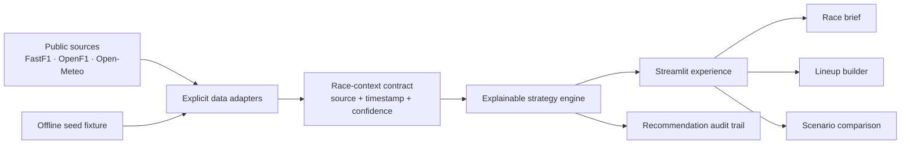
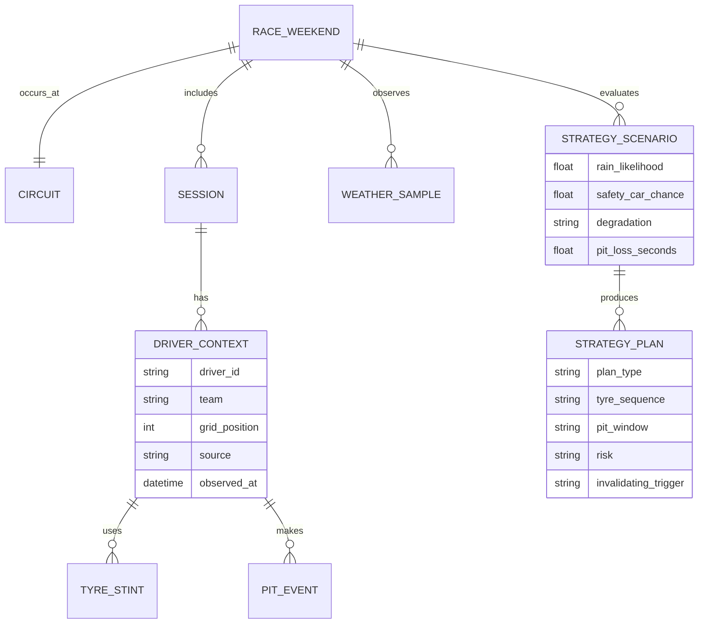
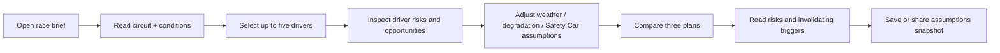
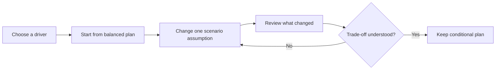
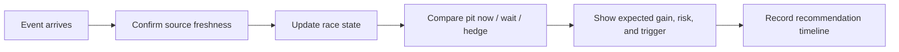

# Product Design

## System architecture

The app starts from a deterministic offline fixture. Future providers are opt-in:
the app must display the active source and timestamp before showing an estimate.

## Data model

## User personas

### The Saturday strategist — primary

An informed F1 enthusiast preparing for a race weekend. They want a short,
credible brief first, then the freedom to test a bold call. They distrust opaque
predictions and value a clear explanation of uncertainty.

### The lineup captain

A small group’s fantasy/competition organiser. They choose up to five drivers,
compare upside with reliability, and share a brief with friends. They need a
stable snapshot of assumptions, not a copied third-party fantasy game.

### The live second-screen fan — later

Watches a race and wants the strategic consequence of a Safety Car, rain shower,
or rival pit stop without pretending to replace a real pit wall. They need speed,
freshness labels, and a concise "pit now / wait / hedge" comparison.

## Core user flows

### Build and share a pre-race plan

### Challenge a strategy

### Live replan — M3

## Interaction rules

- Lead with the recommendation; put evidence and history one step deeper.
- Every plan must show tyre sequence, pit window, upside, risk, and invalidating
  trigger together.
- Use probability bands/ranges; avoid single-position certainty.
- Clearly distinguish confirmed inputs, estimates, and unavailable data.
- Keep scenario controls limited to inputs that materially change a pit call.

## Nice-to-have backlog

- Historical comparable-race explorer and replay.
- Animated circuit/stint timeline and shareable short simulation clip.
- Saved named scenarios and shareable read-only race briefs.
- Live decision timeline with "what changed?" explanations.
- Accessibility preferences and compact second-screen mode.
- Personal performance journal: compare user calls to the eventual race.
- Private teammate spaces, comments, and versioned strategy briefs.
